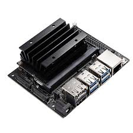
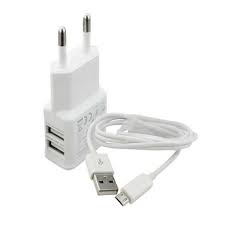
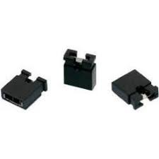
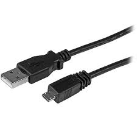
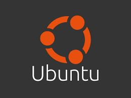
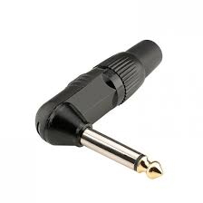
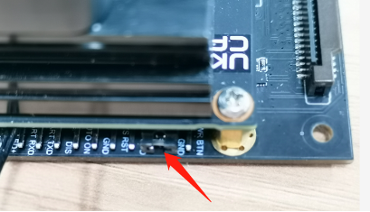
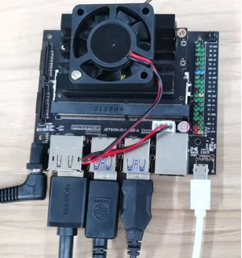

<div align="justify">

# DOFBOT Jetson Nano - Guide de Redémarrage

## Description

Ce guide complet vous accompagne dans le processus de redémarrage et de configuration du DOFBOT Jetson Nano. Il couvre deux étapes essentielles :

1. **Flashage de l'eMMC** : Installation du système de base directement sur la mémoire embarquée de la carte Jetson Nano
2. **Flashage de la clé USB** : Configuration d'une clé USB bootable contenant le système Yahboom optimisé pour le DOFBOT

Ce tutoriel s'adresse aux utilisateurs qui souhaitent réinitialiser leur DOFBOT ou configurer une nouvelle carte Jetson Nano pour un usage robotique avec le bras manipulateur DOFBOT.

## Table des matières

- [1. Flashage de l'eMMC](#1-flashage-de-lemmc)
- [2. Flashage de la clé USB](#2-flashage-de-la-clé-usb)
- [Support](#support)

---

## 1. Flashage de l'eMMC

### Matériel requis

- Carte de développement NVIDIA Jetson Nano Devkit
- Alimentation 5V/2A minimum (Chargeur de smartphone de marque Tecno ou Samsung)
- Jumper (cavalier)
- Câble de données USB Type A / USB Type B micro (Câble Android)
- Ordinateur avec un OS Linux de préférence Ubuntu 22.04 à jour
- Connecteur Jack

<center>
<table>
  <tr>
    <td align="center">
      <br>
      <b>Carte de développement NVIDIA</b>
    </td>
    <td align="center">
      <br>
      <b>Chargeur de smartphone</b>
    </td>
    <td align="center">
      <br>
      <b>Jumper (cavalier)</b>
    </td>
  </tr>
  <tr>
    <td align="center">
      <br>
      <b>Câble Android</b>
    </td>
    <td align="center">
      <br>
      <b>OS Linux</b>
    </td>
    <td align="center">
      <br>
      <b>Connecteur Jack</b>
    </td>
  </tr>
</table>
</center>

### Fichiers nécessaires

- **eMMC Boot File** : [Télécharger depuis Google Drive](https://drive.google.com/drive/folders/13-68trXKoHZ-rgB_1SUaeCMRy3PLhOaA)

### Procédure de flashage

#### Étape 1 : Préparation de la carte

1. Préparez la carte Jetson NANO et les cavaliers (jumpers)
2. Connectez les cavaliers (jumper caps) aux broches **FC REC** et **GND** (deuxième et troisième broches de la carte porteuse situées sous la carte principale)

   > Cette étape permet à la carte Jetson NANO d'entrer en mode de flashage système (REC)

 <td align="center">
      <br>
    </td>
    
#### Étape 2 : Connexion

1. Branchez l'alimentation 5V/2A
2. Connectez la Jetson NANO à votre ordinateur à l'aide du câble micro USB

   > La carte entrera automatiquement en mode de flashage REC après la mise sous tension

 <td align="center">
      <br>
    </td>
    
#### Étape 3 : Vérification du mode boot

Ouvrez le terminal et tapez la commande suivante :

```bash
lsusb
```

Vérifiez que parmi les devices se trouve **"NVIDIA Corp APX"**. Cela confirme que la carte est en boot mode. Sinon, revérifiez la connexion avec le jumper caps.

#### Étape 4 : Extraction du fichier boot

1. Naviguez vers l'emplacement du fichier ZIP téléchargé
2. Faites un clic droit puis ouvrez le terminal dans ce répertoire
3. Dézippez le fichier avec la commande suivante :

```bash
tar xzvf Jetson_Boot_USB.tar.gz
```
 <td align="center">
      <br>
    </td>
    
#### Étape 5 : Navigation dans les dossiers

Entrez dans le dossier dézippé avec les commandes suivantes :

```bash
cd jetson_nano_boot_usb/
ls
cd Linux_for_Tegra/
ls
```

 <td align="center">
      <br>
    </td>

    
#### Étape 6 : Exécution du flashage

Entrez la commande suivante pour exécuter le fichier de démarrage eMMC :

```bash
sudo ./flash.sh -r jetson-nano-devkit-emmc mmcblk0p1
```

> Soyez patient, le fichier est en cours d'écriture sur l'eMMC

#### Étape 7 : Vérification du succès

Si l'écriture réussit, le système affichera :

```
*** The target t210ref has been flashed successfully. ***
Reset the board to boot from internal eMMC.
```

> Si un message d'erreur apparaît, vérifiez que la Jetson NANO est correctement connectée et qu'elle est bien en mode de flashage, puis reprenez les étapes ci-dessus.

#### Étape 8 : Finalisation

Après la fin de l'écriture :
1. Débranchez le cavalier (jumper cap) de la Jetson NANO
2. Retirez les câbles de données et d'alimentation

---

## 2. Flashage de la clé USB

### Matériel requis

- Clé USB Jetson fournie avec le kit
- Ordinateur avec un OS Windows de préférence 10 ou 11

### Fichiers nécessaires

- **SD Card Formatter** : Programme pour formater la clé USB
- **Win32 Disk Imager** : [Télécharger ici](https://sourceforge.net/projects/win32diskimager/)
- **Jetson Boot USB File** : [Télécharger depuis Google Drive](https://drive.google.com/drive/folders/1LekvSSO0XCQG1yxhhXDbEUI3uYuMMSV-)

### Procédure de flashage

#### Étape 1 : Formatage

Formatez la clé USB avec **SD Card Formatter.exe**

#### Étape 2 : Préparation du fichier image

Dézippez le dossier du boot file téléchargé

#### Étape 3 : Écriture de l'image

1. Insérez la clé USB dans l'ordinateur
2. Ouvrez **Win32 Disk Imager**
3. Sélectionnez le fichier `.img` fourni
4. Cliquez sur **"Write"**

#### Étape 4 : Confirmation

Cliquez sur **"Yes"** et patientez pendant que l'image est écrite sur la clé USB

> Lorsque l'interface confirme la réussite, le fichier image a été écrit avec succès sur la clé USB

#### Étape 5 : Démarrage final

1. Retirez la clé USB de l'ordinateur
2. Insérez la clé USB contenant le système Yahboom dans la carte NVIDIA Jetson Nano
3. Mettez l'interrupteur d'alimentation en marche
4. Branchez l'écran, le clavier, la souris, etc.

**Cela devrait marcher !**

---

## Support

Cette documentation a été rédiger par l'équipe **The Winners** de la **Tekbot Robotics Challenge 2025**.

Pour tout problème lié au redémarrage de la carte, veuillez laisser un message à l'adresse mail suivante :

📧 **peacemathieu@gmail.com**

---

## Contributeurs

Ce guide a été créé pour faciliter la configuration du DOFBOT Jetson Nano.

## Licence

Ce projet est fourni à des fins éducatives et de documentation.
</div>
